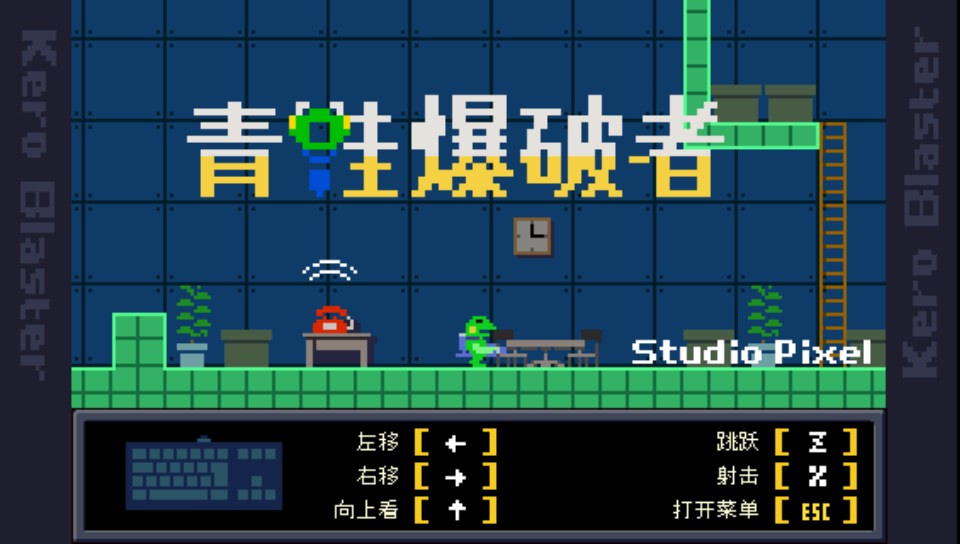

# Kera-Blaster-vita



<p align="center"><a href="README.md">EN</a> | 中文</p>

本仓库是青蛙爆破者 (Android) 的 PS VITA 移植

## 安装方式 (给用户)

本游戏需要安装两个插件、拷贝资源文件才可以正确运行。操作如下：

- 安装插件 [kubridge](https://github.com/TheOfficialFloW/kubridge/releases/)、
  [FdFix](https://github.com/TheOfficialFloW/FdFix/releases/)。可以通过工具箱等方式安装，或者手动安装。
  即复制 `kubridge.skprx` 和 `fd_fix.skprx` 到插件文件夹 (一般是 `ux0:tai`)，并将如下内容增加到 `config.txt`
  文件的 `*KERNEL` 一行下面:

```
  *KERNEL
  ux0:tai/kubridge.skprx
  ux0:tai/fd_fix.skprx
```

**注意** 如果你安装了 repatch 插件，就不用再安装 fd_fix.skprx 了

- 通过合法手段获得 *Kera-Blaster v1.6.0* 的 APK 安装包，更改后缀名为 `.zip`，然后用解压缩软件解压
- 在 PSV 的 `ux0:data` 下新建 `kero` 文件夹
- 把解压后的 `assets` 复制到 `ux0:data/kero` 下
- 把文件 `lib/armeabi-v7a/libpxgame.so` 复制到 `ux0:data/kero` 下
- 安装 [Kero-Blaster.vpk](https://github.com/kaaass/Kero-Blaster-vita/releases)

## 控制方式

移植支持前屏触屏、按键两种方式控制。按键的映射如下：

| PSV 按键        | 默认功能 | 映射为   |
|---------------| -------- | -------- |
| 方向键/左摇杆       | 方向控制 | 方向键   |
| ○             | 跳跃     | Z        |
| ×             | 射击     | X        |
| △/□ 或 L/R     | 武器切换 | A/S      |
| Select        | 打开菜单 | Esc      |
| Start/左背触/右背触 | 按键设置 | F1/F2/F3 |

存档目录为：`ux0:data/kero/profile`

## 编译方式 (给开发者)

请参阅 [README.md](README.md)

## 致谢

请参阅 [README.md](README.md)
