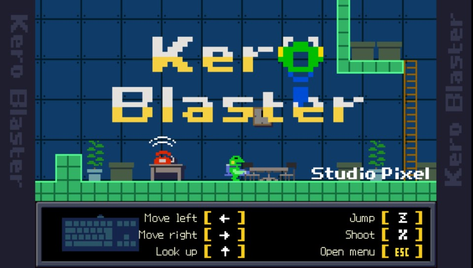

# Kera-Blaster-vita



<p align="center">EN | <a href="README.cn.md">中文</a></p>

Kera Blaster (Android version) port for PS VITA

## Setup Instructions (For End Users)

In order to properly install the game, you'll have to follow these steps precisely:

- Install [kubridge](https://github.com/TheOfficialFloW/kubridge/releases/) and
  [FdFix](https://github.com/TheOfficialFloW/FdFix/releases/) by copying `kubridge.skprx`
  and `fd_fix.skprx` to your taiHEN plugins folder (usually `ux0:tai`) and adding two entries 
  to your `config.txt` under `*KERNEL`:

```
  *KERNEL
  ux0:tai/kubridge.skprx
  ux0:tai/fd_fix.skprx
```

**Note** Don't install fd_fix.skprx if you're using repatch plugin

- Obtain your copy of *Kera-Blaster v1.6.0* legally for Android in form of an `.apk` file. 
  [You can get all the required files directly from your phone](https://stackoverflow.com/questions/11012976/how-do-i-get-the-apk-of-an-installed-app-without-root-access)
  or by using an apk extractor you can find in the play store. The apk can be extracted with
  whatever Zip extractor you prefer (eg: WinZip, WinRar, etc...) since apk is basically a zip 
  file. You can rename `.apk` to `.zip` to open them with your default zip extractor.
- Create a folder `kero` under `ux0:data`
- Open the apk with your zip explorer, extract the `assets` folder from your `.apk` file to 
  `ux0:data/kero`. The result would be `ux0:data/kero/assets`
- Still in the apk, extract the file `libpxgame.so` from the `lib/armeabi-v7a` folder to 
  `ux0:data/kero`.
- Install [Kero-Blaster.vpk](https://github.com/kaaass/Kero-Blaster-vita/releases) on your *PS Vita*.

## Game Controls

You could use both keypad and front touch screen to control. Key mapping is as follows:

| Vita Key          | Default usage | Been mapped to |
| ----------------- | ------------- | -------------- |
| Arrows/L-joystick | Directions    | Arrows Key     |
| Square            | Jump          | Z              |
| Cross             | Shoot         | X              |
| Triangle/Square   | Weapon Switch | A/S            |
| Select            | Open Menu     | Esc            |
| L/R/Start         | Keyconfig     | F1/F2/F3       |

Your saved data are located in `ux0:data/kero/profile`.

## Build Instructions (For Developers)

1. Install [vitasdk](https://github.com/vitasdk)
2. Install following packages to your vitasdk:
   - [oboe](https://github.com/kaaass/oboe-vita)
   - [OpenSLES](https://github.com/frangarcj/opensles)
   - [libmathneon](https://github.com/Rinnegatamante/math-neon)
   - [PVR_PSP2](https://github.com/GrapheneCt/PVR_PSP2/releases)
   - libsndfile
3. Copy suprx of PVR_PSP2 to `./modules`
4. Build with commands:

```shell
mkdir build && cd build
cmake .. && make
```

## Credits

- TheFloW, Rinnegatamante for [twom_vita](https://github.com/TheOfficialFloW/twom_vita#readme), which is used
  as the code base of this project
- Other existing open source Android vita ports projects
- GrapheneCt for PVR_PSP2, which is the graphic backend in this project
- frangarcj for porting OpenSLES

## Progress

- [X] graphic
- [X] input/controll
  - [X] keycode
  - [X] touch screen
  - [X] (left) joystick
- [X] audio
  - [X] se
  - [X] bgm
- [ ] **WIP** game test
